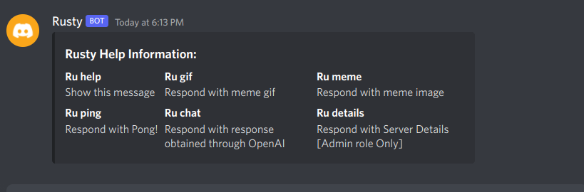

# rusty-discord-bot

Discord Bot in rust using Serenity. Serenity is a Rust library for the Discord API.
This project does not use environment variable for token, id and api. Instead stores in config.toml file and file is then parsed in struct 
and api & role id are passed to Client Builder of serenity by TypeMap. Which can be accessed by Context.

Some Dependencies might not be required.
Adding Dependencies:
```
tokio = { version = "1.18" , features = ["full"] }
reqwest = { version = "0.11", features = ["json"] }
toml = "0.5.9"
serde = "1.0.137"
serde_derive = "1.0.137"
serde_json = "1.0.81"
openai-api-fork ="0.2.1"
```

Edit config.toml:
```
discord_token = "Your Discord Bot Token"
command_prefix = "Command Prefix"
openai_key = "OpenAI API Key"
admin_role = admin_role_id
```

Chat Bot Commands:
```Ru help```
<p align="center">
  
</p>
